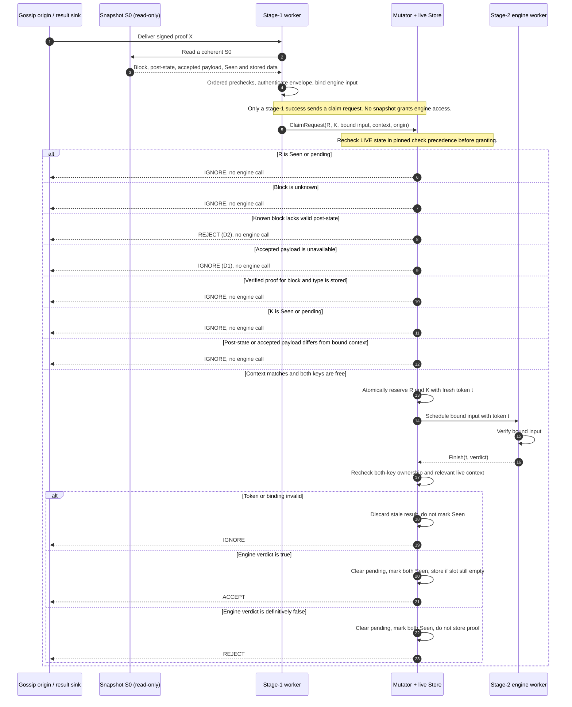
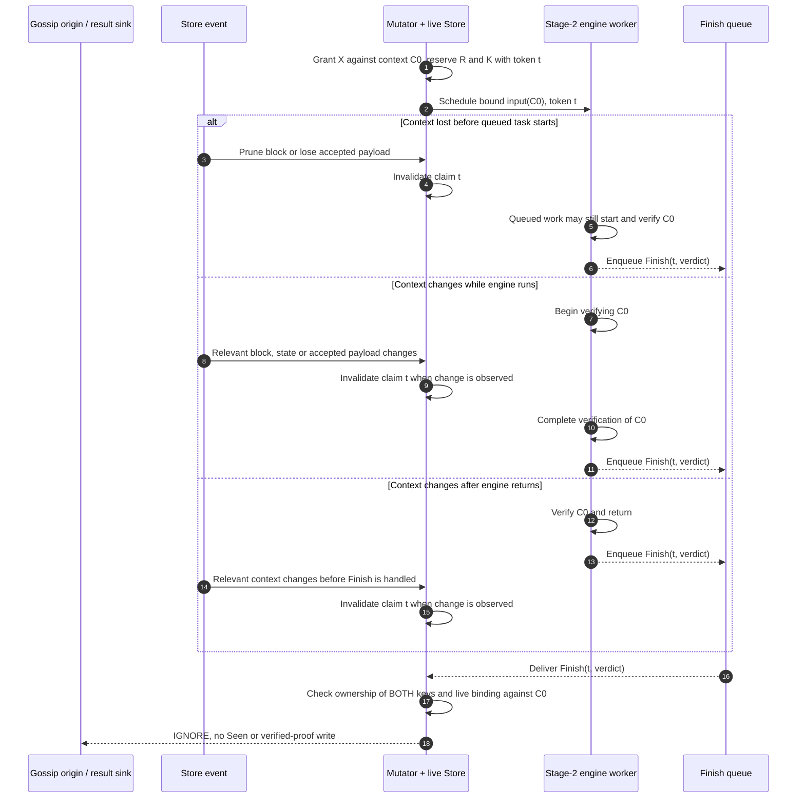
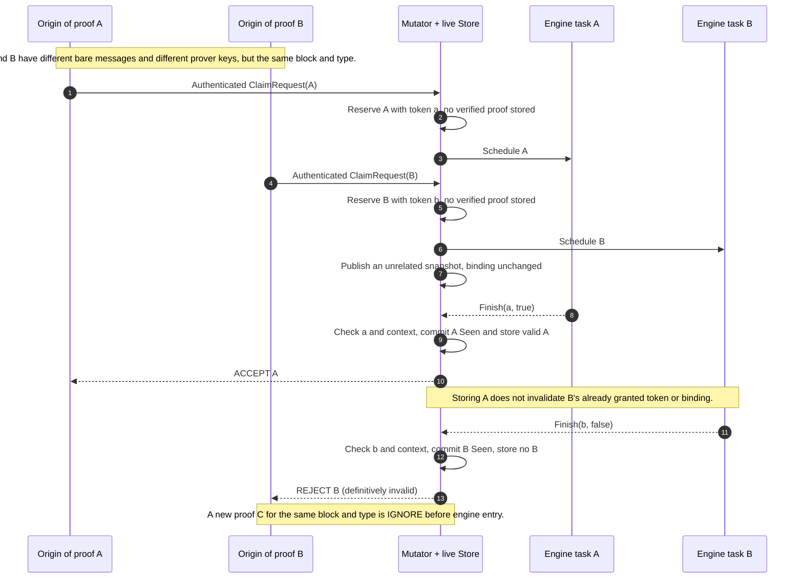
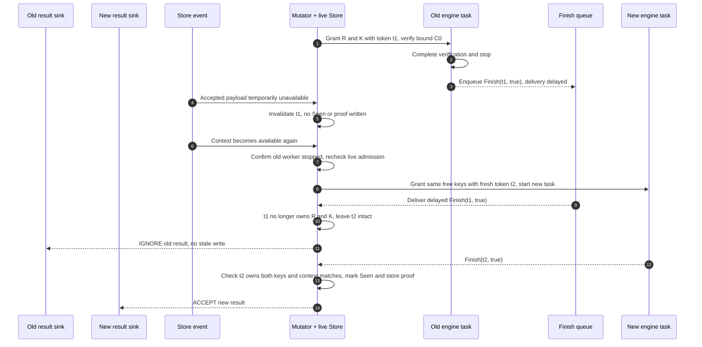

# PR2 — stale-snapshot sequence diagrams

**Status:** teaching aid for the [interview decision log](decisions.md), not an implemented flow. Based on design 0004's pinned consensus-specs `6946894b02f6e95bf5b1daf4ce39a3c3244a1e41`. These diagrams cover meaningful **time windows**, not every fork-choice mutation. A newer snapshot **alone** does not invalidate a proof: the relevant block, post-state, accepted payload/binding, Seen keys, stored proof, and claim ownership determine the outcome. The exact Rust context identity, claim lifecycle, and recovery APIs remain open. Arrows from the mutator to an origin below mean **result signalling**, not a direct mutator-to-peer network call. `R` is the bare-message root; `K` is `(block root, proof type, validator index)`.

## 1. Stage 1 and a stale snapshot **before claim grant**

Stage 1 may itself IGNORE/REJECT before sending any claim request. The claim-time live checks preserve the pinned early-check precedence: a known block without a valid post-state is REJECT even if its payload is also missing. Authentication is **not** repeated on the mutator; the still-open context-identity design must enforce the binding cheaply.

**Old-snapshot race:** A and B both read S0 with empty Seen and authenticate. A's claim reserves `(R,K)` first. When B's claim is processed, the live pending root or prover key is present, so B gets IGNORE without an engine call. Both may already have paid for hashing/BLS. Neither worker mutates S0 or live Seen.

## 2. Relevant context changes **after grant** (before start, during work, or while Finish waits)

These branches illustrate a result that *does* arrive; a canceled queued task might never call the engine or send Finish. Cleanup for non-completion is still open. Even if invalidation is not performed eagerly on a store event, the finish-time live check must prevent stale writes. The engine receives only the input prepared from S0, not S0 itself or write authority. A `true` result cannot resurrect pruned data. An unrelated snapshot publication with **unchanged relevant context and valid token** is not grounds for IGNORE. Another validator storing a valid proof is also not, by itself, a binding change for an already admitted claim (diagram 3).

## 3. A stored proof and an unrelated snapshot update do **not** cancel an admitted claim

If B's engine returned `true`, B would be ACCEPTED as an already admitted proof, but A's verified proof would **not be overwritten**. If A returned `false`, A would be REJECTED with **no verified proof** stored, so B could still succeed. These are the agreed Q13/Q14 local interleaving rules, not a concurrent ordering supplied by the sequential spec. If A and B have the **same bare message**, B conflicts on the pending root even though the validator indices differ: B gets IGNORE at claim and has no engine task. A new attempt arriving *after* A was stored gets IGNORE; it is not the already admitted B.

## 4. Delayed results versus a replaced claim (token fencing)

This is an **illustrative** delayed-message race, not a specified recovery API. The old task has **stopped** before the same keys are granted again: a timer alone must not release t1 while it could still execute. A pruned block's keys cannot be regranted merely to demonstrate fencing; pruning instead makes any late result IGNORE without resurrecting its records. Exactly how a stopped task is confirmed and a delayed result is abandoned is still open. Token fencing prevents stale commits, **not** overlapping engine work if claims are released prematurely.

**Resource caveat:** same-key engine calls cannot overlap in the ordinary granted-claim path. Many *different* authenticated keys and repeated pre-claim hashing/BLS can still consume resources. Admission, queue, and concurrency bounds are required before real gossip ingress is enabled; this design is not a DDoS guarantee.

## Decision checkpoints (read along the diagrams)

| When live state changes | Which decision uses live state? | Proposed outcome |
| --- | --- | --- |
| Before stage-1 worker reads | Worker reads the snapshot supplied | Recheck at claim; snapshot alone never grants engine access |
| Between snapshot read and ClaimRequest handling | Mutator checks live R/Seen/pending, block/state/payload, stored proof, K/Seen/pending, then binding compatibility in pinned early-check precedence | Duplicate or missing block/payload: IGNORE; known block with missing post-state: REJECT; changed binding: IGNORE; no engine |
| After claim grant, before stage-2 starts | Mutator may invalidate claim; queued worker may still run | On finish: IGNORE if token/context invalid; no stale writes; pre-start cancellation not yet specified |
| During engine work | Mutator handles store changes while worker uses bound C0 | Finish-time live check; changed relevant context: IGNORE, no Seen/proof |
| After engine returns, before Finish is handled | Queued result carries token, not write authority | Mutator rechecks; invalidated token or changed binding: IGNORE |
| Only unrelated snapshot update | Binding and token remain valid | Honor the engine result; do **not** discard solely because a new snapshot was published |
| Different validator's valid proof stored while B's earlier claim runs | B's token/context remain valid | B gets its own engine verdict and Seen; store first valid proof only (Q14) |
| Delayed old result after a replacement grant | Mutator checks ownership of both pending keys | Old token: IGNORE without touching new claim; do not grant replacement while old engine may still run |

**Open implementation details:** exact context identity and material-change policy; how stopped workers and abandoned results are detected without timer-only release; handling enqueue failure/panic/shutdown; bounded pending and verifier work; PR2/PR3 division. See [decisions.md](decisions.md) for agreed status and [report.md](report.md) for the in-depth walkthrough.
